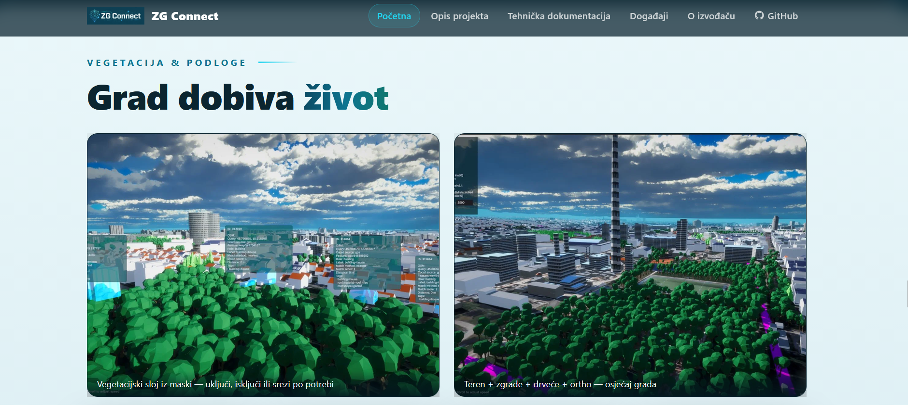

# Zagreb kao gotova Unity lokacija (Curious Cat)

!!! info inline end "Poveznica"
    [https://zg-connect.curiouscat.hr/](https://zg-connect.curiouscat.hr/)

Tim iz Curious Cat iskoristio je 3D model grada Zagreba za izradu
lokacije za _Unity_ platformu za izradu igara. Polazeći od 3D modela,
tim je izradio ponovno upotrebljiv, georeferenciran model grada spreman
za uporabu u igrama ili simulacijama.

Kôd za kreiranje modela dostupan je na
[GitHubu](https://github.com/HRCuriousCat/ZGConnect), a više detalja
o projektu možete pronaći
[ovdje](https://zg-connect.curiouscat.hr/).

